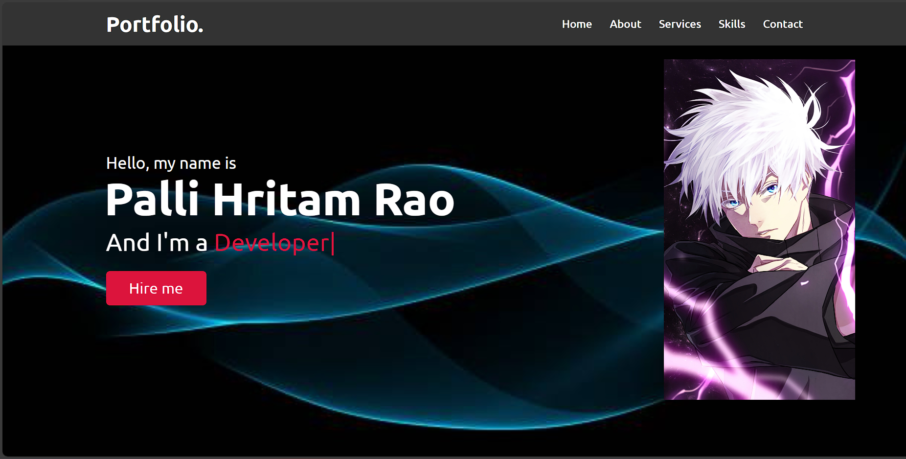
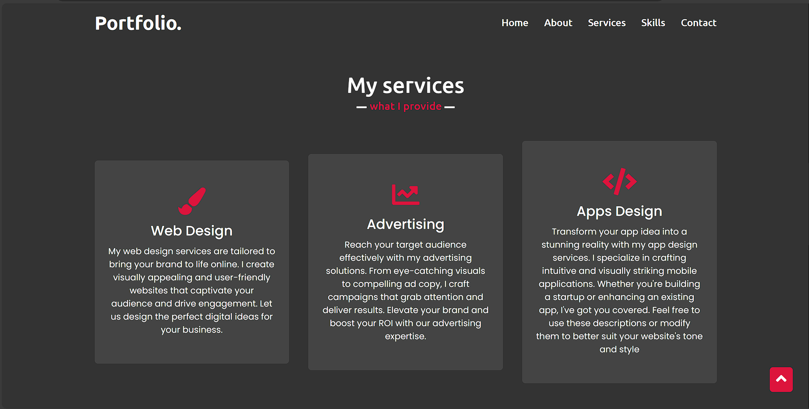

# Portfolio Website



## Description

This is a personal portfolio website designed to showcase my skills, projects, and provide information about me. It serves as an online resume and a platform for potential employers or collaborators to learn more about me and my work.

The website features different sections such as:

- **Home:** An introduction to the website.
- **About:** Information about me, my background, and skills.
- **Services:** Details about the services I offer or skills I possess.
- **Skills:** A list of my technical skills and proficiency.
- **Contact:** Contact information and a form for users to get in touch.

## Table of Contents

- [Description](#description)
- [Live Demo](#live-demo)
- [Table of Contents](#table-of-contents)
- [Installation](#installation)
- [Usage](#usage)
- [Technologies Used](#technologies-used)
- [Contributing](#contributing)
- [License](#license)

## Installation

1. Clone the repository to your local machine using this command:

   ```bash
   git clone https://github.com/your-username/your-portfolio.git
### Usage

1. **Navigate to the project folder:**

   ```bash
   cd your-portfolio
Open the index.html file in your web browser to view the website locally.

Replace the content and images in the index.html file with your own information and project details.

Customize the styling by modifying the CSS in the style.css file to match your preferred design.

Update any links to your social media profiles or additional projects in the HTML file.

Add or remove sections as needed to tailor the portfolio to your specific needs.

Deploy the website to your preferred hosting platform or domain.

Technologies Used
HTML5
CSS3
JavaScript (if applicable)
FontAwesome (for icons)
Google Fonts (for custom fonts)
